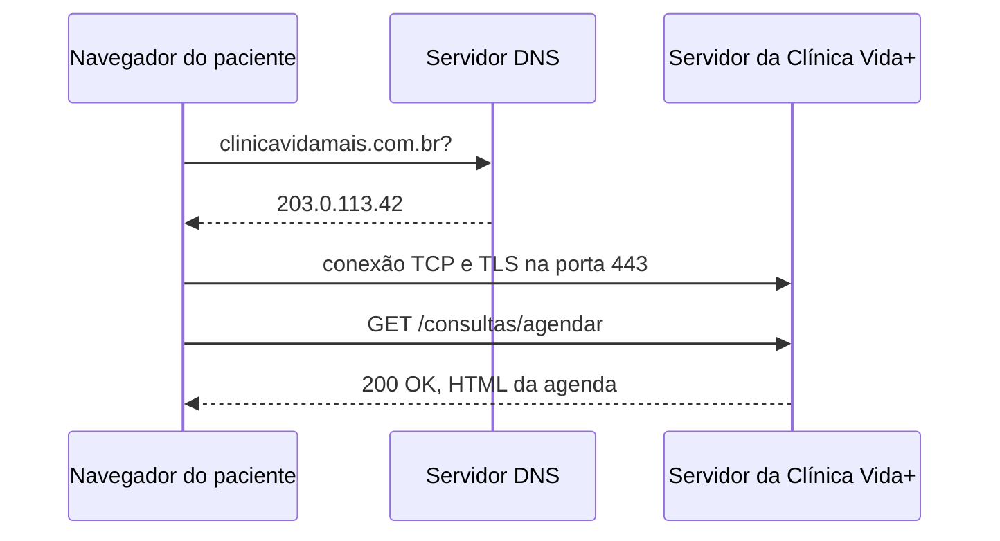

# Laboratório da Aula 02

## Disciplina: Desenvolvimento Web
**Prof. José Romualdo | Uninove, Universidade Nove de Julho**

### Case: Clínica Vida+ (Fase 0, arquitetura da requisição)

Na Aula 01 você criou o fork de
[`josercf/uninove-2026-2-clinica-vida`](https://github.com/josercf/uninove-2026-2-clinica-vida),
configurou a identidade do Git e enviou o commit
`docs: identificação do aluno no README`. Aquele repositório é o mesmo de
hoje e será o mesmo até dezembro.

O entregável de hoje ainda não é código do sistema: é o documento que
descreve **por qual caminho o site da Clínica Vida+ vai passar a operar**.
Você coleta evidência real de DNS e de HTTP, desenha o caminho da requisição
e justifica a decisão de usar HTTPS no formulário de agendamento que será
construído na Aula 05.

**Duração:** 60 minutos. Passos 1 e 2 guiados pelo professor, passos 3 e 4
individuais.

---

## Pré-requisitos

- O fork da Aula 01 clonado e funcionando na sua máquina.
- Git configurado com o seu nome e o seu e-mail.
- Um navegador com DevTools (Chrome, Edge ou Firefox).
- Terminal com `nslookup` (ou `dig`, no Linux e no macOS).

---

## Passo 1: investigar o DNS (15 min, guiado)

Escolha um domínio para investigar: `uni9.br`, `github.com` ou outro que
você use.

```bash
nslookup uni9.br            # o nome, o servidor DNS consultado e o endereço devolvido
nslookup uni9.br 8.8.8.8    # a mesma pergunta, feita a outro servidor DNS
nslookup github.com         # compare: um domínio grande devolve vários endereços

ping uni9.br                # o IP que aparece precisa ser um dos devolvidos acima
```

Copie a saída inteira de um dos comandos. Ela vira um bloco de código no
documento do Passo 3.

Se o `nslookup` não existir na sua máquina, use `dig SEU-DOMINIO` no Linux
ou no macOS. Em rede corporativa o servidor consultado pode ser interno:
registre o que aparecer, é evidência igual.

---

## Passo 2: a aba Network do DevTools (20 min, guiado)

Abra no navegador o mesmo site que você investigou no passo anterior.

1. Pressione `F12` e abra a aba **Network**. Recarregue a página com o
   DevTools aberto.
2. Registre **pelo menos quatro requisições**, anotando de cada uma o
   método, o recurso pedido e o código de status.
3. Procure ao menos um recurso que não seja HTML: um `.css`, um `.js` ou
   uma imagem.
4. Clique em uma requisição e leia os cabeçalhos: `Host`, `User-Agent` e
   `Content-Type`.
5. Peça um endereço que não existe, como `/pagina-que-nao-existe`, e
   confirme o `404` na lista.

Monte a anotação já no formato da tabela que vai para o documento:

| Método | Recurso | Status |
|---|---|---|
| GET | `/` | 200 |
| GET | `/css/estilo.css` | 200 |
| GET | `/js/app.js` | 200 |
| GET | `/pagina-que-nao-existe` | 404 |

---

## Passo 3: escrever `docs/arquitetura.md` (15 min, individual)

Dentro do seu fork, crie a pasta `docs` e o arquivo `arquitetura.md`. O
diagrama pode ser em texto ou em Mermaid, que o GitHub renderiza sozinho.

````markdown
# Arquitetura da Clínica Vida+

## O caminho de uma requisição



## Evidência do DNS

(cole aqui, em bloco de código, a saída do `nslookup` do Passo 1)

## Evidência do HTTP

(cole aqui a tabela com as quatro requisições do Passo 2)

## Por que o formulário de agendamento precisa de HTTPS

(o parágrafo do Passo 4)
````

---

## Passo 4: o parágrafo do HTTPS, commit e push (10 min, individual)

Feche o documento com um parágrafo seu, de **três a cinco linhas**,
explicando por que o formulário de agendamento da Clínica Vida+ vai
precisar de HTTPS. Cite ao menos **um dado sensível** que o formulário
carrega: CPF, telefone, data de nascimento ou motivo da consulta.

```bash
git status                       # docs/arquitetura.md aparece como não rastreado
git add docs/arquitetura.md
git commit -m "docs: arquitetura da requisicao e evidencias de DNS e HTTP"
git push
```

Atualize a página do seu fork no GitHub e abra `docs/arquitetura.md`. O
bloco Mermaid precisa aparecer **desenhado**, não como código.

---

## Entregável

`docs/arquitetura.md` commitado e enviado ao seu fork, contendo:

- o diagrama do caminho da requisição, do navegador do paciente até o
  servidor e de volta;
- a saída do `nslookup` de um domínio investigado;
- a tabela com **pelo menos quatro requisições** observadas no DevTools,
  cada uma com método, recurso e código de status;
- um parágrafo, de três a cinco linhas, justificando o HTTPS no formulário.

### Critérios de aceitação

| # | Critério | Como o professor confere |
|---|---|---|
| 1 | O arquivo existe no lugar certo | `docs/arquitetura.md` aparece no seu fork no GitHub, dentro da pasta `docs` |
| 2 | O diagrama mostra o caminho completo | O diagrama nomeia navegador, DNS e servidor, e mostra ida e volta, não só a ida |
| 3 | O diagrama renderiza | Se for Mermaid, o GitHub o exibe desenhado; se for texto, está dentro de um bloco de código |
| 4 | A evidência de DNS é real | O bloco de código traz a saída do `nslookup` ou do `dig`, com o servidor consultado e o endereço devolvido |
| 5 | A evidência de HTTP tem quatro linhas | A tabela lista pelo menos quatro requisições, cada uma com método, recurso e código de status |
| 6 | Há ao menos um status diferente de 200 | Pelo menos uma das requisições registradas traz outro código, por exemplo `301`, `304` ou `404` |
| 7 | O parágrafo do HTTPS cita um dado sensível | O texto nomeia CPF, telefone, data de nascimento ou motivo da consulta, e liga isso ao risco de trafegar em texto puro |
| 8 | O trabalho foi enviado | O commit aparece no GitHub, com o seu nome ao lado, e não apenas no `git log` da sua máquina |

---

## Se algo der errado

- **`nslookup: command not found`**: a ferramenta não está instalada. Use
  a alternativa da sua plataforma:
  ```bash
  dig uni9.br          # Linux e macOS
  Resolve-DnsName uni9.br   # PowerShell, no Windows
  ```
- **O bloco Mermaid aparece como texto no GitHub**: a cerca de código não
  diz `mermaid`, ou o diagrama tem erro de sintaxe. Confira que a primeira
  linha do bloco é exatamente ```` ```mermaid ```` e que a última é ```` ``` ````.
- **`fatal: pathspec 'docs/arquitetura.md' did not match any files`**: o
  arquivo foi criado fora da pasta do repositório, ou com outro nome.
  Confira com:
  ```bash
  git status
  ls docs
  ```
- **A aba Network aparece vazia**: o DevTools foi aberto depois do
  carregamento. Deixe-o aberto e recarregue a página com `Ctrl+R` ou
  `Cmd+R`.
- **`Permission denied (publickey)` no push**: o remoto está em SSH sem
  chave cadastrada. Volte para HTTPS:
  ```bash
  git remote set-url origin https://github.com/SEU-USUARIO/uninove-2026-2-clinica-vida.git
  ```
